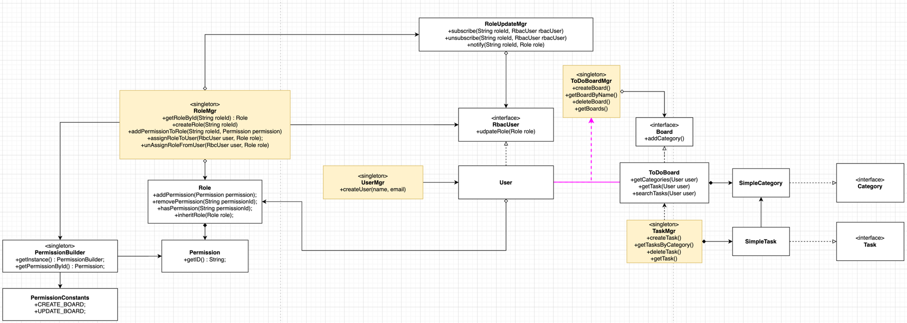

# Todo list with RBAC

An idea was to make a todo list but to also experiment with access control.
After research and discussion with community ([StackExchange post](https://softwareengineering.stackexchange.com/questions/450645/design-user-permissions/450646?noredirect=1#comment992237_450646)) I decide to try RBAC model.

It is fear to split system onto three parts: 
1. Yellow blocks.
2. RBAC part.
3. Todo-list part.

## Yellow blocks
1. Represents potential database connection.
2. Designed as singleton (to mock DB and do not create new collections of users, tables, boards).

## RBAC part
I designed RBAC as I understand it.
I'm pretty sure I may have made a mistake somewhere, but overall I have proven that access control can be achieved using 
the system I developed. 
So at least it's not a dead horse.

### General RBAC Design
Design consists of four parts:
1. Permission set.
   1. Ability to associate resource with permission.
2. Ability to create roles and assign them to Users.
3. Ability to validate that user has rights to do corresponding action.
4. *ability to customize role and ensure that all applicable users received role updates.

### Observer part 
To ensure that whenever a role receives updates, all users assigned to that role also receive updates, I implement
Observer pattern.

An idea was to implement an interface **RbacUser** which should ensure that User is compatible with RBAC.

* RoleUpdateMgr - Publisher. RoleMgr use this class to assign roles to users (perhaps this can be separated to 
the separate class)
* RbacUser - Subscriber interface. Is used to define RBAC user related methods to support role update/assign/unassigned. 
* User - Concrete Subscriber.

### Access validation
Every method of every class which should enforce exact level of access should:

1. Take a User obj as a parameter.
2. Define what permissions are required. 
 
An example of such validation you may find in classes as ToDoBoard, ToDoBoardMgr.

## Todo-list part
* ToDoBoardMgr store all created boards.
* TaskMgr store all create tasks per board.
* SimpleCategory is used as a Class alternative of a task status. 
